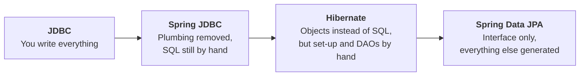
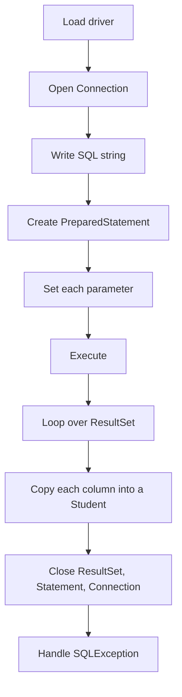
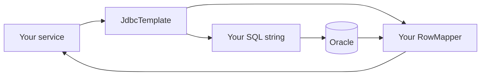
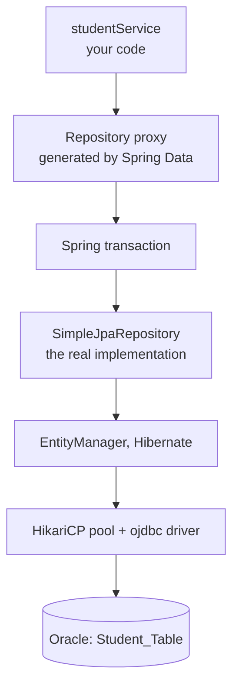
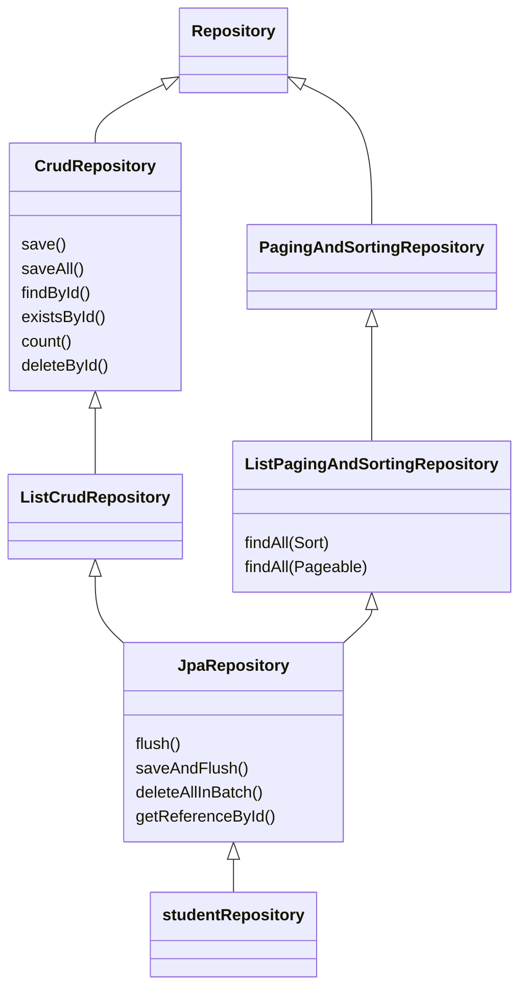
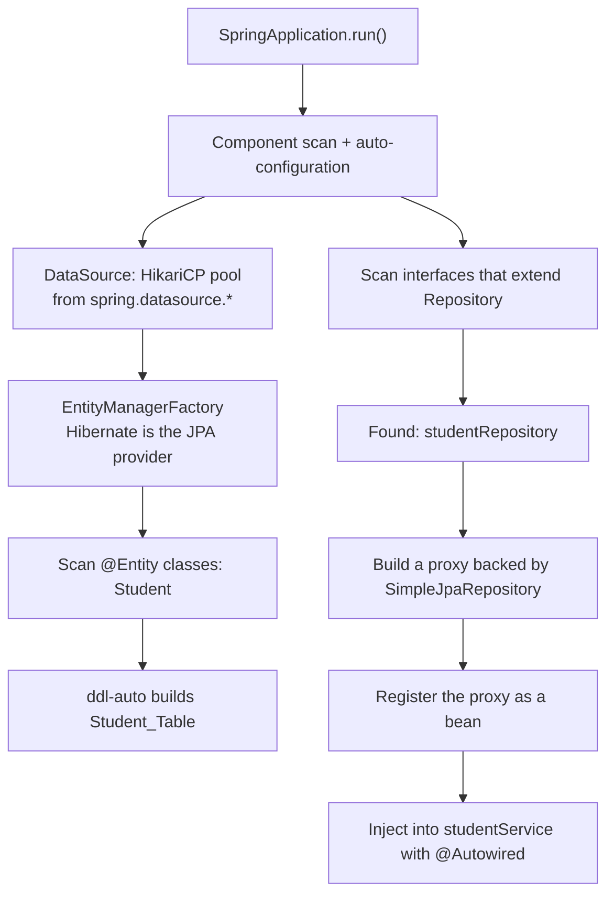
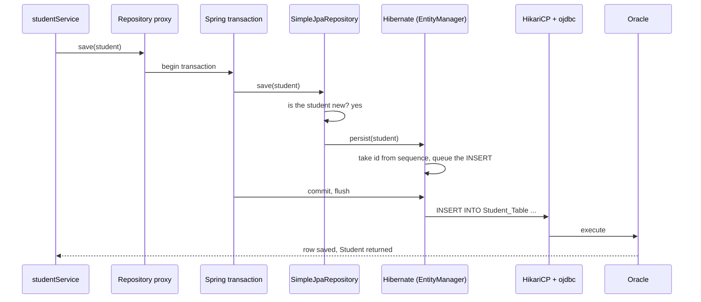
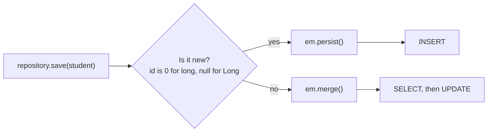
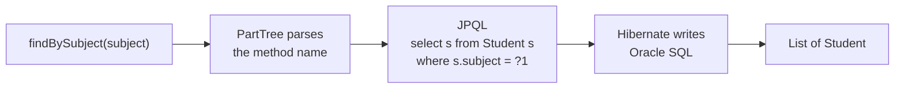

<p align="center">
  
</p>

<p align="center">
  
</p>

<p align="center">
  
  
  
  
  
  
</p>

A Spring Boot application for a coaching centre. It stores students (name, subject, fees) in an Oracle table using **Spring Data JPA**, so the only persistence code you write is one empty interface.

---

## What this project does

- Maps the `Student` class to the Oracle table `Student_Table`.
- Declares `studentRepository extends JpaRepository<Student, Long>`, which gives you save, find, list, count and delete without writing them.
- Lets Spring Boot set up the connection pool, Hibernate and the table from `application.yml`.

> **Heads up:** the current `main` method creates a `Student` object but never saves it, so no row reaches Oracle yet. The fix is in [Make it actually save data](#make-it-actually-save-data).

## Why Spring Data JPA matters

Most of a database layer is the same code repeated for every entity: save, find one, find all, delete. Spring Data JPA writes that code for you, so you spend your time on the coaching logic instead.

| Benefit | What it means in this project |
|---|---|
| **No DAO code** | `studentRepository` has an empty body, yet `save`, `findById`, `findAll`, `deleteById` and `count` all work |
| **CRUD, paging and sorting built in** | `findAll(PageRequest.of(0, 10))` returns the first ten students |
| **Queries from method names** | `findBySubject("Spring Boot")` runs a query with no SQL written |
| **Automatic transactions** | Every repository method runs inside a transaction |
| **Spring Boot auto-configuration** | No `hibernate.cfg.xml`, no `SessionFactory`, just `application.yml` |
| **Less code to test and maintain** | Fewer lines means fewer bugs |
| **Portable** | Change the URL and driver to move to another database |
| **One pattern for every entity** | A new entity needs one new interface |

**Without Spring Data JPA** you write a DAO like this for every entity:

```java
public class StudentDao {

    public void save(Student s) {
        Session session = factory.openSession();
        Transaction tx = session.beginTransaction();
        session.persist(s);
        tx.commit();
        session.close();
    }

    public Student find(long id)         { /* open session, find, close */ }
    public List<Student> findAll()       { /* open session, query, close */ }
    public void delete(long id)          { /* open session, tx, remove, commit, close */ }
}
```

**With Spring Data JPA** you write this:

```java
public interface studentRepository extends JpaRepository<Student, Long> { }
```

## From JDBC to Spring Data JPA

Each step in this path removed work from the developer, and each step still had a cost that the next one fixed.



### 3D view: what you carry in each approach

Each block is a stack of layers. `YOU` is code you write and maintain. `AUTO` is done by the framework. `APP` is your actual business logic.

**1. JDBC** carries seven layers of plumbing on top of your logic:

```
    ┌────────────────────────────────────────────┐
   ╱                                            ╱│
  ┌────────────────────────────────────────────┐ │
  │ Business logic                        APP  │ │
  ├────────────────────────────────────────────┤ │
  │ Load driver + open Connection         YOU  │ │
  ├────────────────────────────────────────────┤ │
  │ Write SQL strings                     YOU  │ │
  ├────────────────────────────────────────────┤ │
  │ Set every ? parameter                 YOU  │ │
  ├────────────────────────────────────────────┤ │
  │ Read ResultSet row by row             YOU  │ │
  ├────────────────────────────────────────────┤ │
  │ Copy columns into objects             YOU  │ │
  ├────────────────────────────────────────────┤ │
  │ try / catch / finally / close         YOU  │ │
  ├────────────────────────────────────────────┤ │
  │ Commit and rollback                   YOU  │╱
  └────────────────────────────────────────────┘
```

**2. Spring JDBC** removes the connection and transaction layers, but SQL and mapping stay with you:

```
    ┌────────────────────────────────────────────┐
   ╱                                            ╱│
  ┌────────────────────────────────────────────┐ │
  │ Business logic                        APP  │ │
  ├────────────────────────────────────────────┤ │
  │ Connections + closing                 AUTO │ │
  ├────────────────────────────────────────────┤ │
  │ Exception translation                 AUTO │ │
  ├────────────────────────────────────────────┤ │
  │ Transactions (@Transactional)         AUTO │ │
  ├────────────────────────────────────────────┤ │
  │ Write SQL strings                     YOU  │ │
  ├────────────────────────────────────────────┤ │
  │ Pass parameters                       YOU  │ │
  ├────────────────────────────────────────────┤ │
  │ Write a RowMapper per query           YOU  │ │
  ├────────────────────────────────────────────┤ │
  │ Joins for relationships               YOU  │╱
  └────────────────────────────────────────────┘
```

**3. Hibernate** removes SQL and mapping, but you still build the `SessionFactory`, manage sessions and transactions, and write a DAO per entity:

```
    ┌────────────────────────────────────────────┐
   ╱                                            ╱│
  ┌────────────────────────────────────────────┐ │
  │ Business logic                        APP  │ │
  ├────────────────────────────────────────────┤ │
  │ Config XML + SessionFactory           YOU  │ │
  ├────────────────────────────────────────────┤ │
  │ Open Session + Transaction            YOU  │ │
  ├────────────────────────────────────────────┤ │
  │ Write a DAO class per entity          YOU  │ │
  ├────────────────────────────────────────────┤ │
  │ persist / find / remove               YOU  │ │
  ├────────────────────────────────────────────┤ │
  │ SQL generation                        AUTO │ │
  ├────────────────────────────────────────────┤ │
  │ Object to row mapping                 AUTO │ │
  ├────────────────────────────────────────────┤ │
  │ Cache + dirty checking                AUTO │╱
  └────────────────────────────────────────────┘
```

**4. Spring Data JPA** leaves you with an entity and an interface:

```
    ┌────────────────────────────────────────────┐
   ╱                                            ╱│
  ┌────────────────────────────────────────────┐ │
  │ Business logic                        APP  │ │
  ├────────────────────────────────────────────┤ │
  │ Entity + annotations                  YOU  │ │
  ├────────────────────────────────────────────┤ │
  │ Repository interface                  YOU  │ │
  ├────────────────────────────────────────────┤ │
  │ Auto-configuration                    AUTO │ │
  ├────────────────────────────────────────────┤ │
  │ Sessions + transactions               AUTO │ │
  ├────────────────────────────────────────────┤ │
  │ CRUD, paging, sorting                 AUTO │ │
  ├────────────────────────────────────────────┤ │
  │ Queries from method names             AUTO │ │
  ├────────────────────────────────────────────┤ │
  │ SQL + mapping (Hibernate)             AUTO │╱
  └────────────────────────────────────────────┘
```

Layers you write yourself:

| Approach | Layers you own | |
|---|---|---|
| JDBC | 7 | `███████` |
| Spring JDBC | 4 | `████` |
| Hibernate | 4 | `████` |
| **Spring Data JPA** | **2** | `██` |

## Drawbacks of each approach

### 1. Plain JDBC



That is one query. Every query repeats all ten steps.

| Drawback | What it looks like | Effect |
|---|---|---|
| Too much boilerplate | Connection, statement and result set code around every query | Long, repetitive code that hides the real logic |
| Manual resource handling | You must close `ResultSet`, `Statement` and `Connection` | A missed `close()` leaks connections |
| Checked `SQLException` | `try / catch` in every method | Noisy code |
| Manual object mapping | `rs.getString("Student_name")` for each column | A renamed column breaks at runtime |
| SQL strings in code | Typos are found only when the query runs | Errors appear late |
| Tied to one database | Oracle syntax such as `SEQUENCE.NEXTVAL` in the SQL | Switching database means rewriting queries |
| No caching or change tracking | Updates are written by hand | Extra queries and code |
| Manual transactions | `setAutoCommit(false)`, `commit()`, `rollback()` | Easy to forget rollback |

```java
String sql = "INSERT INTO Student_Table (Std_id, Student_name, subject, Coaching_Fees) "
           + "VALUES (student_seq.NEXTVAL, ?, ?, ?)";

try (Connection con = DriverManager.getConnection(url, user, password);
     PreparedStatement ps = con.prepareStatement(sql)) {

    ps.setString(1, student.getName());
    ps.setString(2, student.getSubject());
    ps.setFloat(3, student.getFees());
    ps.executeUpdate();

} catch (SQLException e) {
    e.printStackTrace();
}
```

### 2. Spring JDBC

`JdbcTemplate` removes the connection and exception plumbing, but you still work with rows and SQL, not objects.



| Drawback | What it looks like | Effect |
|---|---|---|
| SQL is still hand-written | Every query is a string in your code | Typos found only at runtime |
| A `RowMapper` for every query | You copy column values into `Student` yourself | Mapping code grows with each table |
| No object relationships | Joins and object assembly by hand | No `student.getCourse()` for free |
| Tied to one database | Oracle-specific SQL stays in the code | Moving to MySQL means rewriting SQL |
| No caching, lazy loading or dirty checking | Every read hits the database | More queries and code |
| No schema generation | Tables come from separate DDL scripts | Class and table can drift apart |
| CRUD written for every entity | `insert`, `update`, `delete`, `findAll` repeated | The same code copied per table |

```java
jdbcTemplate.update(
    "INSERT INTO Student_Table (Std_id, Student_name, subject, Coaching_Fees) VALUES (student_seq.NEXTVAL, ?, ?, ?)",
    student.getName(), student.getSubject(), student.getFees());

List<Student> students = jdbcTemplate.query(
    "SELECT Std_id, Student_name, subject, Coaching_Fees FROM Student_Table",
    (rs, rowNum) -> {
        Student s = new Student();
        s.setId(rs.getLong("Std_id"));
        s.setName(rs.getString("Student_name"));
        s.setSubject(rs.getString("subject"));
        s.setFees(rs.getFloat("Coaching_Fees"));
        return s;
    });
```

### 3. Plain Hibernate

Hibernate removes SQL and mapping, but it is not wired into Spring. You configure it and drive it by hand.

| Drawback | What it looks like | Effect |
|---|---|---|
| Heavy set-up | `hibernate.cfg.xml`, `Configuration`, and a `SessionFactory` you build and keep as a singleton | A whole class just to get a connection |
| Session and transaction plumbing | `openSession()`, `beginTransaction()`, `commit()`, `close()`, plus rollback on failure | Repeated around every operation |
| A DAO class per entity | Same `save`, `find`, `findAll`, `delete` written again and again | Copy and paste code |
| Entities registered by hand | `<mapping class="..."/>` for each entity | A forgotten line fails at start-up |
| No Spring integration | No dependency injection, no `@Transactional` | You manage object lifecycles yourself |
| Queries are HQL strings | Checked only at runtime, paging written with `setFirstResult` and `setMaxResults` | Late errors, more code |
| Session scope errors | Touching a lazy field after `session.close()` | `LazyInitializationException` |

```java
Session session = ConnectionStablizer.getConnection().openSession();
Transaction tx = session.beginTransaction();
try {
    session.persist(student);
    tx.commit();
} catch (Exception e) {
    tx.rollback();
} finally {
    session.close();
}
```

## How Spring Data JPA overcomes them

| Problem | JDBC | Spring JDBC | Hibernate | **Spring Data JPA** |
|---|---|---|---|---|
| Set-up | Driver and URL in code | `DataSource` bean | XML + `SessionFactory` | `application.yml`, auto-configured |
| Writing SQL | Every query | Every query | Generated, or HQL | Generated, plus query methods |
| Object mapping | Manual | `RowMapper` | Annotations | Annotations |
| CRUD methods | You write them | You write them | A DAO per entity | Inherited from `JpaRepository` |
| Transactions | Manual | `@Transactional` | Manual API | Automatic |
| Paging and sorting | Hand-written SQL | Hand-written SQL | Hand-written HQL | `Pageable` and `Sort` |
| Relationships | Manual joins | Manual joins | `@OneToOne` and others | `@OneToOne` and others |
| Connection pool | You | Spring | Extra set-up | HikariCP by default |
| Spring integration | None | Full | Manual | Full |
| Best for | Tiny tools, learning | SQL-heavy reporting | Apps without Spring | Most Spring Boot apps |

The same work with Spring Data JPA:

```java
repository.save(student);                        // INSERT, in a transaction
Optional<Student> s = repository.findById(1L);   // SELECT by Std_id
List<Student> all   = repository.findAll();      // SELECT all
repository.deleteById(1L);                       // DELETE
```

> **When the older tools still make sense:** hand-tuned reports, bulk loads of millions of rows, or very small tools. Spring Data JPA also lets you drop to SQL with `@Query(nativeQuery = true)` when you need it.

## Spring Data JPA in detail

**Spring Data JPA is a layer on top of JPA.** It is not a JPA provider. Hibernate is the provider that does the real work, and JDBC talks to the database underneath. Spring Data JPA's job is to remove the repetitive code between your service and Hibernate.

### The layers, 3D view

Follow a single `save(student)` call from top to bottom. `SDJ` is Spring Data JPA and Spring, `HIB` is Hibernate.

```
    ┌────────────────────────────────────────────┐
   ╱                                            ╱│
  ┌────────────────────────────────────────────┐ │
  │ studentService: save(student)         YOU  │ │
  ├────────────────────────────────────────────┤ │
  │ Repository proxy (generated)          SDJ  │ │
  ├────────────────────────────────────────────┤ │
  │ Transaction begins                    SDJ  │ │
  ├────────────────────────────────────────────┤ │
  │ SimpleJpaRepository                   SDJ  │ │
  ├────────────────────────────────────────────┤ │
  │ Hibernate builds the INSERT           HIB  │ │
  ├────────────────────────────────────────────┤ │
  │ HikariCP pool + ojdbc driver          JDBC │ │
  ├────────────────────────────────────────────┤ │
  │ Oracle: Student_Table                 DB   │╱
  └────────────────────────────────────────────┘
```



### The repository family

`studentRepository` inherits its methods from this family. You add nothing.



### Methods you get for free

| Method | What it does | SQL Hibernate runs on `Student_Table` |
|---|---|---|
| `save(student)` | Insert a new student or update an existing one | `INSERT ...` or `UPDATE ...` |
| `saveAll(list)` | Save many | One `INSERT` per student |
| `findById(1L)` | One student by `Std_id`, as an `Optional` | `SELECT ... WHERE Std_id = ?` |
| `findAll()` | All students | `SELECT ...` |
| `findAll(Sort.by("fees"))` | All students, sorted | `SELECT ... ORDER BY Coaching_Fees` |
| `findAll(PageRequest.of(0, 10))` | One page of ten | `SELECT ...` with paging, plus a count |
| `existsById(1L)` | Does the row exist | `SELECT count(...)` |
| `count()` | Number of students | `SELECT count(*)` |
| `deleteById(1L)` | Remove one | `SELECT`, then `DELETE` |

### Query methods: write the name, get the query

Add a method to the interface, and Spring Data reads its name and builds the query.

```java
public interface studentRepository extends JpaRepository<Student, Long> {

    List<Student> findBySubject(String subject);
    List<Student> findByNameContainingIgnoreCase(String part);
    List<Student> findByFeesGreaterThan(float amount);
    List<Student> findBySubjectOrderByFeesDesc(String subject);
    List<Student> findTop3ByOrderByFeesDesc();
    long countBySubject(String subject);
    boolean existsByName(String name);
}
```

| Method name | Meaning |
|---|---|
| `findBySubject` | `WHERE subject = ?` |
| `findByNameContainingIgnoreCase` | `WHERE upper(Student_name) LIKE upper('%part%')` |
| `findByFeesGreaterThan` | `WHERE Coaching_Fees > ?` |
| `findBySubjectOrderByFeesDesc` | `WHERE subject = ? ORDER BY Coaching_Fees DESC` |
| `findTop3ByOrderByFeesDesc` | The three highest fees |
| `countBySubject` | `SELECT count(*) WHERE subject = ?` |

Keywords you can combine: `And`, `Or`, `Between`, `LessThan`, `GreaterThan`, `Like`, `Containing`, `StartingWith`, `In`, `IsNull`, `OrderBy`, `Top`, `First`, `Distinct`.

If a method name does not match a field, the application **fails at start-up**, not at run time.

For anything the name cannot express, write the query yourself:

```java
@Query("select s from Student s where s.fees between :min and :max")
List<Student> feesBetween(@Param("min") float min, @Param("max") float max);

@Query(value = "SELECT * FROM Student_Table WHERE ROWNUM <= 5", nativeQuery = true)
List<Student> firstFive();
```

### Transactions

`SimpleJpaRepository` is marked `@Transactional(readOnly = true)` for reads, and its write methods (`save`, `delete`) use a normal `@Transactional`. You get correct transactions without writing any.

### Your entity, explained

| Line | Meaning |
|---|---|
| `@Entity` | This class is a table |
| `@Table(name="Student_Table")` | The table name |
| `@Data` (Lombok) | Generates getters, setters, `equals`, `hashCode`, `toString` |
| `@Id` | Primary key |
| `@GeneratedValue(strategy = AUTO)` | Hibernate picks the id strategy. On Oracle it uses a sequence |
| `@Column(name="Coaching_Fees")` | Column name. Fields without `@Column` use the field name |

## How Spring Data JPA works

### At start-up



1. `@SpringBootApplication` switches on component scanning and auto-configuration.
2. Spring Boot reads `spring.datasource.*` and builds a **HikariCP** connection pool.
3. It builds the JPA `EntityManagerFactory` with **Hibernate**, finds `@Entity Student`, and `ddl-auto` creates `Student_Table`.
4. Spring Data scans for interfaces that extend `Repository` and finds `studentRepository`.
5. It builds a **proxy** whose real implementation is `SimpleJpaRepository<Student, Long>`.
6. Query methods are parsed now, so a wrong method name stops the application immediately.
7. The proxy becomes a bean and is injected into `studentService`.

### When you call `save()`



### How `save()` decides between insert and update



Your `id` is a primitive `long`, so a value of `0` means new. Once Hibernate assigns an id, the same object saved again becomes an update.

### How a query method becomes SQL



## Project structure

```
Student
├── src/main/java
│   ├── com.lab
│   │   └── studentCoaching.java        main class, @SpringBootApplication
│   ├── com.lab.Entity
│   │   └── Student.java                entity → Student_Table
│   ├── com.lab.Repository
│   │   └── studentRepository.java      extends JpaRepository
│   └── com.lab.Service
│       └── studentService.java         business logic
├── src/main/resources
│   └── application.yml                 database + JPA settings
└── pom.xml
```

## Data model

| Column | Java field | Type |
|---|---|---|
| `Std_id` | `id` | `long`, primary key, generated |
| `Student_name` | `name` | `String` |
| `subject` | `Subject` | `String` |
| `Coaching_Fees` | `fees` | `float` |

## Configuration explained

```yaml
spring:
  application:
    name: Student

  datasource:
    url: jdbc:oracle:thin:@localhost:1521:ORCL
    username: YOUR_USER
    password: ${DB_PASSWORD}
    driver-class-name: oracle.jdbc.OracleDriver

  jpa:
    hibernate:
      ddl-auto: update
    show-sql: true
```

| Property | Meaning |
|---|---|
| `spring.datasource.url` | JDBC URL. `ORCL` after the last colon is the SID |
| `username` and `password` | Database login. Read the password from an environment variable |
| `driver-class-name` | Oracle JDBC driver class |
| `spring.jpa.hibernate.ddl-auto` | What Hibernate does to the tables at start-up |
| `spring.jpa.show-sql` | Print every generated SQL statement |

| `ddl-auto` value | Effect |
|---|---|
| `none` | Do nothing |
| `validate` | Check that the tables match the entities |
| `update` | Add missing tables and columns, keep data |
| `create` | **Drop and recreate the tables on every start** (your current setting) |
| `create-drop` | Create on start, drop on shutdown |

## Make it actually save data

Your `main` builds a `Student` but never calls the repository, and `studentService` has no methods. Add a method to the service:

```java
@Service
public class studentService {

    private final studentRepository repository;

    public studentService(studentRepository repository) {
        this.repository = repository;
    }

    public Student save(Student student) {
        return repository.save(student);
    }

    public List<Student> findAll() {
        return repository.findAll();
    }
}
```

Then call it from `main`:

```java
studentService bean = context.getBean(studentService.class);

Student student = new Student();
student.setName("Adarsh");
student.setSubject("Spring Boot");
student.setFees(2500.00f);

bean.save(student);                       // the missing line
System.out.println(bean.findAll());
```

## Run it

**Requirements:** JDK 17 or newer, Maven, and an Oracle database on port 1521.

Your `pom.xml` needs these dependencies:

```xml
<dependency>
    <groupId>org.springframework.boot</groupId>
    <artifactId>spring-boot-starter-data-jpa</artifactId>
</dependency>
<dependency>
    <groupId>com.oracle.database.jdbc</groupId>
    <artifactId>ojdbc11</artifactId>
    <scope>runtime</scope>
</dependency>
<dependency>
    <groupId>org.projectlombok</groupId>
    <artifactId>lombok</artifactId>
    <optional>true</optional>
</dependency>
```

**1. Set the database password** (Windows PowerShell shown, use `export` on Linux and macOS)

```powershell
$env:DB_PASSWORD="your_password"
```

**2. Run**

```bash
mvn spring-boot:run
```

**3. Check the result in SQL*Plus or SQL Developer**

```sql
SELECT * FROM Student_Table;
```

## Before you run

> **Nothing is saved yet.** `main` creates a `Student` and stops. Add the `save` call shown above.

> **`ddl-auto: create` wipes your data.** It drops and recreates the tables on every start. Use `update` once you want rows to survive a restart.

> **Keep passwords out of Git.** Replace `system123` with `${DB_PASSWORD}` and set it as an environment variable. Also avoid using the `system` account for applications.

> **Follow Java naming rules.** Classes start with a capital letter (`StudentRepository`, `StudentService`, `StudentCoaching`), and fields start lowercase (`subject`, not `Subject`). Derived queries such as `findBySubject` depend on the field name. Also fix the `reposiotory` typo.

> **Use `BigDecimal` for money.** `float` cannot store amounts like `2500.10` exactly. `BigDecimal fees` is the safe choice for fees.

> **Prefer constructor injection** over `@Autowired` on a field. It is easier to test and cannot leave the field empty.

---

<p align="center">Built with Spring Boot, Spring Data JPA, Hibernate and Oracle</p>
